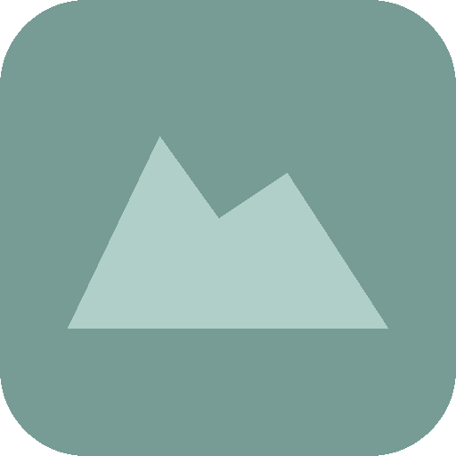
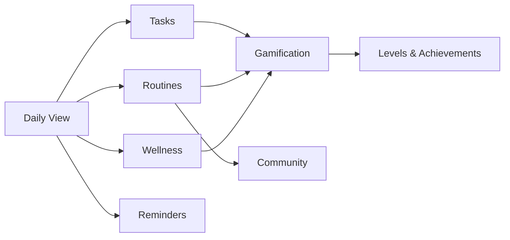
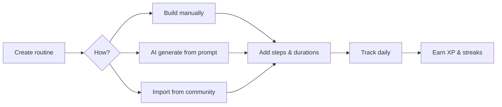
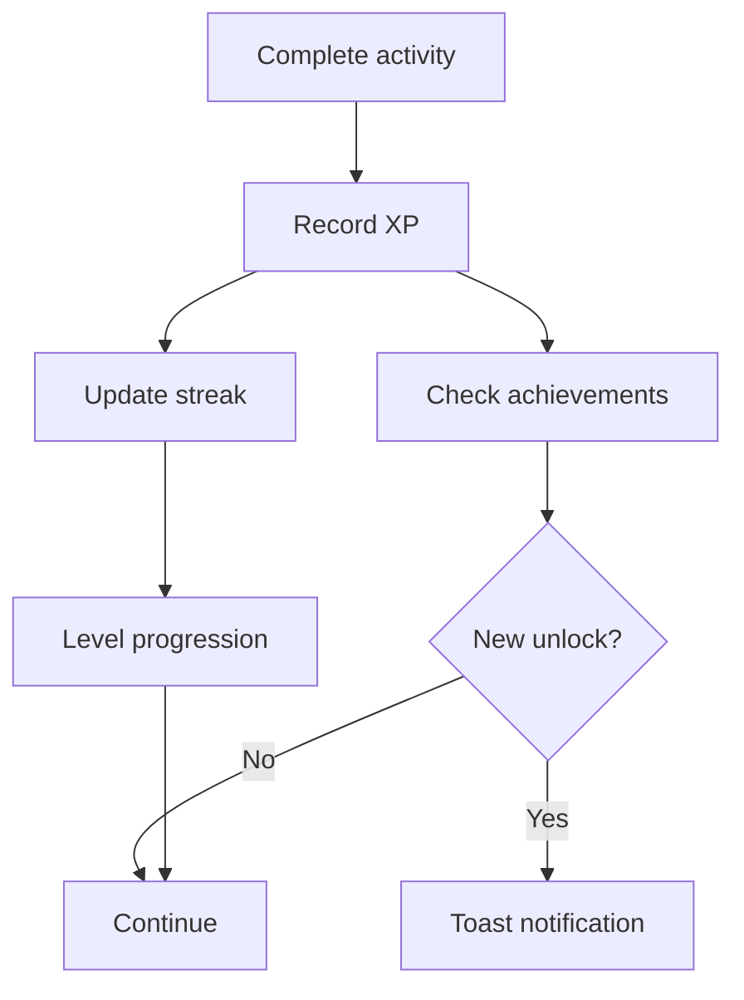
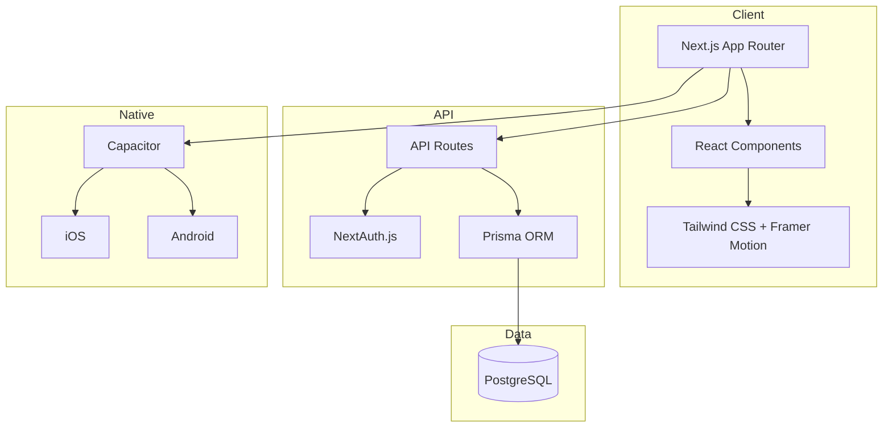

<p align="center">
  
</p>

<p align="center">
  <strong>Your executive function companion.</strong><br/>
  A personal productivity app that helps you manage tasks, build routines, track wellness, and stay on top of your day — without feeling overwhelmed.
</p>

<p align="center">
  
  
  
  
  
  
</p>

---

## Overview

Cove is designed around the idea that productivity tools should adapt to you, not the other way around. Every module is opt-in, the interface stays calm and uncluttered, and the focus is always on helping you follow through — not adding more to your plate.



## Features

### Tasks

Create, organize, and complete tasks with priority levels, due dates, and categories. Completing tasks earns XP toward your progress level and triggers achievement unlocks.

### Routines

Build step-by-step routines with optional time tracking and durations. Use AI-powered generation to create routines from a simple description, or browse community-shared routines for inspiration.



### Focus Timer

A Pomodoro-style timer with focus, short break, and long break sessions. Tracks your daily focus count and automatically cycles between work and rest periods.

### Wellness Tracker

Log your mood, energy, and sleep with a simple 1–5 scale. View trends over time with 30-day pattern analysis to spot what's working and what isn't.

### Reminders

Schedule reminders with flexible recurrence (daily, weekly, specific days) and natural language AI parsing. Supports browser notifications and native push notifications on mobile.

### Gamification

Earn XP across every module. Level up from Seedling to Legendary, maintain streaks with 7-day activity dots, and unlock achievements as you build consistency.



### Community

An opt-in, pseudonymous library where users can share routines for others to browse. Filter by tags, mark routines as helpful, and import them into your own Cove with one click. No profiles, no comments, no pressure.

### Planner

A time-grid calendar view paired with priority zone columns — Must Do, Should Do, Could Do. Drag items between zones or onto the timeline to plan your day visually.

---

## Architecture



## Design

Cove uses a calm, nature-inspired design language with soft earth tones, rounded corners, and gentle animations. Multiple themes are available, and the interface is fully responsive across desktop, tablet, and mobile.

| Principle | Description |
|---|---|
| **Opt-in modules** | Every feature can be enabled or disabled independently |
| **Calm interface** | Muted palette, no red badges, no notification anxiety |
| **Gentle gamification** | Streaks pause instead of resetting — no punishment for missing a day |
| **Privacy first** | Community participation is pseudonymous and completely optional |

## Tech Stack

| Layer | Technology |
|---|---|
| Framework | Next.js (App Router) |
| Language | TypeScript |
| Styling | Tailwind CSS |
| Animation | Framer Motion |
| Database | PostgreSQL |
| ORM | Prisma |
| Auth | NextAuth.js |
| Native | Capacitor (iOS / Android) |

## Run on iPhone Simulator

Cove's native iOS shell loads the Next.js server, so local mobile development
uses the web dev server and Xcode together. Node.js 22 or newer is required by
Capacitor 8.

```bash
npm install
npm run cap:sync
npm run dev
```

In a second terminal:

```bash
npm run cap:open
```

Select an iPhone simulator in Xcode and press Run. The simulator can reach the
Mac's development server at `http://localhost:3000`.

For a hosted build, sync with Cove's HTTPS deployment URL before building:

```bash
COVE_SERVER_URL=https://your-cove-host.example npm run cap:sync
```

The checked-in `native-shell/` page is an offline fallback. Cove itself remains
server-backed because authentication, API routes, and Prisma cannot be exported
as a static Next.js site.
